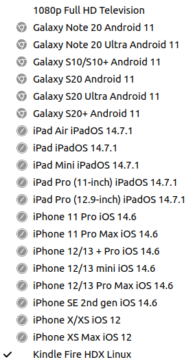

This test task completed by VKTech.
Technology that are used here:
PHP, HTML, CSS, JavaScript, Swiper.js, MySql.

Adaptive's been made for the next devices:

Task: 

    1. Сверстать страницу
    - done
    
    2. Сделать адаптив
    - done
    
    3. Создать БД для хранения героев
    - done
    
    4. Подключить слайдер для вывода героев
    - done
    
    5. Вывести слайдер с героями на страницу
    - done
    
    6. Написать обработчик на PHP для сохранения новых героев
    - done
    
    7. Запрограммировать форму для добавления новых героев используя асинхронный запрос JS в базу данных
    - done 
    
    9. При добавлении нового героя: герой сразу же появляется на странице (без перезагрузки страницы, async query)
    - done, but the size of the picture displays incorrectly 
    
    10. Настроить drag&drop для загрузки фото героя
    - not finished
    
    11. Сайт опубликовать в веб
    - done

debug report:

D & D 
("create" form problems):

u can't finish post request onto the db (upload picture) if  u use drag N drop

html allows to send only 1 picture whereas js allows to add bunch of them. So u can face the case where u send thru the form few pictures and all of them go to storage, but only last one would be displayed.
